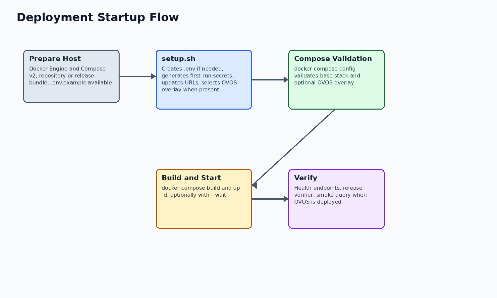
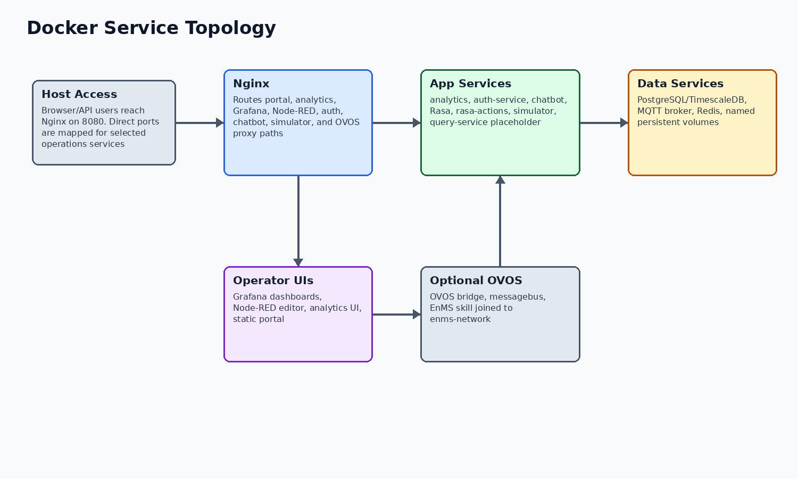

# Docker Deployment Report

Project: WASABI / HumanEnerDIA / OVOS-EnMS
Version: 1.0
Date: 2026-06-08
Status: Final delivery documentation package

Purpose: Document Docker Compose deployment, configuration, startup, verification, health checks, and operational troubleshooting.
Audience: Operators, deployment engineers, technical reviewers, and external partner infrastructure teams.

Evidence rule: Deployment claims are based on compose files, Dockerfiles, setup and verification scripts, and local compose validation.

## Deployment Overview

The deployment target described by the repository is a Linux host running Docker Engine and Docker Compose v2. The base stack is defined by docker-compose.yml. Full-stack release bundles can include docker-compose.ovos.yml to add the OVOS runtime and skill.

The setup helper is the intended guided path. It creates .env from .env.example when needed, generates first-run secrets for placeholders, validates Docker Compose, builds images, and starts the stack. It also adjusts OVOS_BRIDGE_HOST when an OVOS overlay is present.

## Compose Service Topology

The base deployment uses one Docker bridge network for HumanEnerDIA services. Nginx is the browser/API gateway; analytics, auth-service, chatbot/Rasa, simulator, Node-RED, Grafana, PostgreSQL/TimescaleDB, MQTT, and Redis communicate on the internal network. OVOS can be added as a separate service joined to the same network.

## Docker Compose Services

| Service | Image or build context | External port/path | Responsibility | Healthcheck |
| --- | --- | --- | --- | --- |
| nginx | nginx:1.25-alpine | 8080; 8443 mapped but HTTPS server block is optional/commented until certificates are configured | Public gateway, portal/static hosting, reverse proxy | Yes |
| postgres | timescale/timescaledb:latest-pg16 | 5433 | PostgreSQL with TimescaleDB extension and persistent data volume | Yes |
| mqtt | build ./mqtt | 1883, 9001 | Mosquitto telemetry broker with configured credentials | Yes |
| redis | redis:7-alpine | 6380 | Redis cache and Pub/Sub support for analytics event paths | Yes |
| simulator | build ./simulator | internal 8003 | FastAPI synthetic telemetry generator loaded from database machines | Yes |
| nodered | build ./nodered | 1881 | MQTT-to-database ingestion and automation flow runtime | Yes |
| grafana | grafana/grafana:10.2.0 | 3001, /grafana | Provisioned dashboards backed by PostgreSQL/TimescaleDB | Yes |
| analytics | build ./analytics | 8001, /api/analytics | FastAPI analytics, KPI, reports, ISO 50001, and OVOS proxy APIs | Yes |
| query-service | build ./query-service | 8002 | Reserved placeholder; healthcheck disabled and not a readiness signal | No |
| auth-service | build ./auth-service | 5500 | Flask auth, admin, contact, pilot/application APIs | Yes |
| rasa-actions | build ./chatbot/rasa | 5055 | Rasa custom action server | Yes |
| rasa | build ./chatbot/rasa | 5005 | Rasa NLU text chatbot server | Yes |
| chatbot | build ./chatbot | 5006 | Express backend and built chatbot frontend proxying to Rasa and OVOS | Yes |

## Networks, Volumes, And Ports

All core services join the Docker bridge network named by ENMS_NETWORK_NAME, defaulting to enms-network. The OVOS overlay also joins that network and depends on analytics service health.

Persistent named volumes include PostgreSQL data, MQTT data/logs, Redis data, Node-RED data, Grafana data, and OVOS/supervisor logs when the OVOS overlay is used.

| Resource | Configured name/default | Purpose |
| --- | --- | --- |
| Network | ${ENMS_NETWORK_NAME:-enms-network} | Service-to-service communication |
| postgres-data | ${VOLUME_PREFIX:-enms}-postgres-data | PostgreSQL/TimescaleDB persistent data |
| grafana-data | ${VOLUME_PREFIX:-enms}-grafana-data | Grafana runtime data |
| redis-data | ${VOLUME_PREFIX:-enms}-redis-data | Redis append-only persistence |
| mqtt-data/logs | ${VOLUME_PREFIX:-enms}-mqtt-data and -mqtt-logs | Mosquitto runtime data and logs |
| ovos-logs | ${VOLUME_PREFIX:-enms}-ovos-logs | OVOS runtime logs when overlay deployed |

## Environment Variables And Configuration

.env.example is the safe public configuration template. The real .env file is intentionally not included and must not be committed or copied into documentation. The setup helper generates first-run values for placeholders and preserves existing non-placeholder values.

Important configuration groups include database credentials, Redis password, MQTT credentials, Grafana admin credentials, Node-RED credential secret and password hash, JWT secret, API key, server IP/frontend URL, Grafana root URL, simulator controls, OVOS bridge host/port/timeout, and SMTP/admin settings.

- Use .env.example in documentation, not .env.
- Rotate generated first-run credentials before production exposure.
- Set DNS, TLS, firewall rules, and public URLs explicitly for production.

## Startup, Shutdown, And Reinstall Procedures

Supported startup paths are ./setup.sh or manual Docker Compose commands after .env is prepared. Supported stop/start procedures use docker compose down/up or docker compose restart without deleting volumes. Destructive volume deletion is not part of routine operations.

| Procedure | Command or source | Notes |
| --- | --- | --- |
| Guided setup | ./setup.sh [--server-ip HOST] [--no-build] [--no-start] | Creates/updates .env, validates compose, builds and starts by default. |
| Manual validation | docker compose config | Base validation succeeded in this documentation pass. |
| Manual start | docker compose build; docker compose up -d | Use after .env has no placeholders. |
| Restart service | docker compose restart analytics | Use service-specific logs to confirm recovery. |
| Stop without deleting data | docker compose down | Keeps persistent volumes. |
| Clean reinstall | Only when data removal is intended; do not use down -v casually | Back up data first. |

## Verification Scripts And Health Checks

The repository provides release and API verification scripts. These scripts are evidence of intended operational checks, but their success depends on a running stack and reachable services. In this documentation run, compose validation was executed; live health checks were not implied.

| Check | Purpose | Evidence/status |
| --- | --- | --- |
| docker compose config --quiet | Validate Compose syntax/resolution | Ran successfully for base HumanEnerDIA stack. |
| docker compose -f /home/ubuntu/ovos-llm/docker-compose.yml config --quiet | Validate OVOS-only compose | Ran successfully. |
| scripts/verify-wasabi-release.sh --skip-shop | Checks Nginx, analytics, OVOS bridge, OVOS smoke query when services are running | Script inspected; not run because runtime stack health was not established. |
| scripts/validate_api_documentation.sh | Checks critical analytics/API documentation endpoints against a running service | Script inspected; not run because it requires live analytics and test data. |
| Service healthchecks | Container-level checks for most services | Configured in docker-compose.yml; query-service disabled. |

## Production Hardening And Troubleshooting

The repository provides release-oriented defaults, placeholders, health checks, and hardening notes, but it should not be represented as automatically production-hardened. Operator action is required for DNS, TLS, firewall restrictions, credential rotation, backups, and monitoring policy.

| Symptom | Likely area | First checks |
| --- | --- | --- |
| Portal does not load | Nginx or portal static files | curl /health; docker compose logs nginx |
| Analytics API returns 500 | Analytics, PostgreSQL, Redis | logs for analytics/postgres/redis; /api/v1/health |
| No new telemetry | Simulator, MQTT, Node-RED | logs for simulator/mqtt/nodered; Node-RED flow status |
| Grafana unavailable | Grafana or database | Grafana health endpoint; credentials and volume status |
| Auth errors | auth-service, database, SMTP | /api/auth/health; auth-service logs |
| OVOS voice path unavailable | OVOS bridge/messagebus or analytics proxy | OVOS /health; analytics /api/v1/ovos/voice/health |
| query-service health missing | Expected placeholder state | Do not use query-service as readiness blocker. |

## Limitations And Assumptions

The following items should be reviewed before stakeholder distribution. They are documented to avoid overstating the current implementation.

| Item | Status |
| --- | --- |
| query-service | Placeholder only; Docker service exists, healthcheck disabled, and it is excluded from release readiness expectations. |
| Runtime verification | This documentation package records compose validation. Live health checks require a running deployment and are not implied unless run separately. |
| OVOS release artifact | The OVOS source tree may contain local GGUF model files, but release notes state optional GGUF weights are not bundled by default. |
| Third-party EnMS support | OVOS portability is through a HumanEnerDIA-compatible API or adapter/proxy, not zero-code support for arbitrary vendor APIs. |
| Reports V2 | V2 report code is implemented, but some service calculations use derived/proportional or placeholder values; final stakeholders should review report semantics before audit use. |
| Simulator inventory | The simulator code supports boiler in addition to compressor, HVAC, motor, pump, and injection molding. One simulator info response still lists five machine types. |
| Security posture | The codebase provides secret placeholders, generated first-run credentials, JWT/bcrypt auth, health checks, and hardening guidance. Public production exposure still requires operator DNS/TLS/firewall/credential work. |

## Evidence References

The table below lists the main local evidence used for this document. It is not a full file inventory; it identifies the sources behind the material claims.

| Topic | Evidence |
| --- | --- |
| Base compose | docker-compose.yml |
| OVOS overlay | scripts/release/docker-compose.ovos.yml |
| Setup helper | setup.sh |
| Verifier | scripts/verify-wasabi-release.sh |
| Operations | docs/OPERATIONS_RUNBOOK.md; docs/DELIVERY_READINESS.md |
| OVOS Docker | /home/ubuntu/ovos-llm/Dockerfile; /home/ubuntu/ovos-llm/docker-compose.yml |
