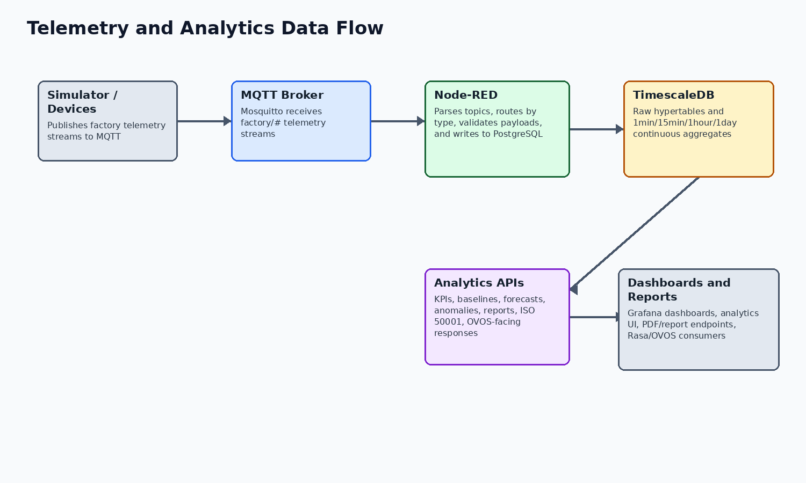

# Energy Management System Reports and KPI Reports

Project: WASABI / HumanEnerDIA / OVOS-EnMS
Version: 1.1
Date: 2026-06-09
Status: Final stakeholder-ready documentation package

Purpose: Document implemented energy data, KPI, dashboard, and report capabilities with formulas and evidence.
Audience: Energy managers, project reviewers, operators, analytics maintainers, and external partners.

Source basis: KPI formulas are included only where defined in SQL functions, code, dashboard queries, or tracked documentation.

## Energy Data Model

HumanEnerDIA stores factory/site records, machines/SEUs, high-frequency energy readings, production data, environmental context, machine status, baseline metadata, anomaly records, tariffs, carbon factors, audit records, ISO 50001 entities, model tracking, forecast output, and action plans.

The first-start seed data defines two sample factories and eight sample machines across the demo and European facilities. The machine examples include Compressor-1, HVAC-Main, Conveyor-A, Hydraulic-Pump-1, Injection-Molding-1, Boiler-1, Compressor-EU-1, and HVAC-EU-North.

The data model table identifies the key records used for energy management, reporting, analytics, and ISO 50001-oriented workflows.

| Concept | Implemented representation | Evidence |
| --- | --- | --- |
| Factories | factories table and seed data for Demo Manufacturing Plant and European Production Facility | database/init/02-schema.sql; 06-seed-data.sql |
| Machines/SEUs | machines table plus ISO-oriented seus and SEU performance tables | database/init/02-schema.sql; 07-iso50001-schema.sql |
| Energy readings | energy_readings hypertable with energy_type, power, energy, electrical quality fields, metadata | database/init/02-schema.sql; 03-timescaledb-setup.sql |
| Production data | production_data hypertable for production count, quality, throughput, mode, downtime | database/init/02-schema.sql |
| Environmental data | environmental_data hypertable for temperature, humidity, pressure, flow, HVAC, vibration context | database/init/02-schema.sql |
| Energy sources | energy_sources and energy_source_features support multi-energy/source-aware modeling | database/init/07-iso50001-schema.sql; 10a-energy-source-features.sql |

This model shows that useful energy reporting depends on aligned factory, machine, telemetry, tariff, carbon, and production records.

## KPI Formula Evidence

The following KPI formulas are implemented as database functions and wrapped by analytics/services/kpi_service.py. Some additional API routes compute aggregate factory cost/carbon estimates with constants; those should be described as route-level estimates rather than tariff/factor driven SQL functions.

The formula table separates implemented KPI calculations from higher-level dashboard or report presentation.

| KPI | Formula or calculation | Implementation | Evidence |
| --- | --- | --- | --- |
| Specific Energy Consumption | SEC = total energy kWh / total production units | calculate_sec() over energy_readings_1hour and production_data_1hour | database/init/04-functions.sql; /api/v1/kpi/sec |
| Peak demand | Maximum 15-minute peak_demand_kw in selected period | calculate_peak_demand() over energy_readings_15min | database/init/04-functions.sql; /api/v1/kpi/peak-demand |
| Load factor | Average power divided by maximum power | calculate_load_factor() over energy_readings_15min | database/init/04-functions.sql; /api/v1/kpi/load-factor |
| Energy cost | Energy multiplied by tariff rate; active time-of-use tariff selected when configured | calculate_energy_cost() queries energy_tariffs with default fallback rate | database/init/04-functions.sql; /api/v1/kpi/energy-cost |
| Carbon intensity/emissions | Energy multiplied by active carbon factor, with default factor fallback | calculate_carbon_intensity() queries carbon_factors | database/init/04-functions.sql; /api/v1/kpi/carbon |
| Combined KPI response | Aggregates SEC, peak demand, load factor, cost, and carbon | calculate_all_kpis() and KPIService.calculate_all_kpis() | database/init/04-functions.sql; analytics/services/kpi_service.py |

The formulas provide traceable calculation evidence for key metrics. They also identify which metrics depend on production counts, tariff records, carbon factors, or aggregate freshness.

## KPI Catalog And Classification

This catalog distinguishes implemented KPI formulas from configured dashboard/reporting views and route-level estimates. It is intentionally conservative so stakeholder readers can see which measures are calculation-backed and which require review before formal use.

The classification table helps readers distinguish calculation-backed KPIs, configured views, and measures that require governance for formal use.

| KPI/reporting item | Classification | Implementation basis | Caution |
| --- | --- | --- | --- |
| SEC | Supported by implementation | calculate_sec SQL function and /api/v1/kpi/sec route | Requires energy and production aggregate data for the selected period. |
| Peak demand | Supported by implementation | calculate_peak_demand SQL function and route | Uses 15-minute aggregate peak_demand_kw. |
| Load factor | Supported by implementation | calculate_load_factor SQL function and route | Depends on average/max power availability. |
| Energy cost | Supported by implementation | calculate_energy_cost SQL function and service wrapper | Uses active tariff rows when present and default fallback in SQL. |
| Carbon intensity/emissions | Supported by implementation | calculate_carbon_intensity SQL function and carbon route | Uses carbon_factors with fallback factor; not independent emissions assurance. |
| Factory KPI rollups | Implemented/configured | /api/v1/kpi/factory/{factory_id} and /api/v1/kpi/factories | Some route-level estimates use constants or aggregate assumptions; formal audit use requires independent validation. |
| Model performance KPIs | Implemented/configured | model_performance routes and dashboards | R2/RMSE/MAPE-style metrics depend on recorded model history. |
| Operational efficiency/OEE | Configured dashboard/reporting view | Grafana operational-efficiency dashboards and production route | Formal operational reporting requires validation of the dashboard SQL, source data, and reporting definitions. |

The classification helps stakeholders interpret dashboards and reports with the appropriate confidence level for each measure.

## Analytics Endpoints And Modules

This table groups the reporting and analytics routes by capability area so readers can connect dashboard/report features to API implementation.

| Capability area | Implemented routes/modules | Notes |
| --- | --- | --- |
| KPI | /api/v1/kpi/sec, /factory, /factories, /peak-demand, /load-factor, /energy-cost, /carbon, /all | Machine and factory KPI endpoints exist; formulas vary by endpoint. |
| Baselines | /baseline/train, /deviation, /predict, /models, /drivers, /train-seu | ML baseline model metadata and saved model files are present. |
| Forecasts | /forecast/train/arima, /train/prophet, /predict, /demand, /optimal-schedule, /models, /peak, /short-term | Uses forecasting model modules and forecast prediction tables. |
| Anomalies | /anomaly/create, /detect, /search, /recent, /active, /resolve | Anomaly detection and search APIs with anomaly table evidence. |
| Performance and ISO 50001 | /performance/analyze, /opportunities, /action-plan, /health; /iso50001/* | Performance engine and ISO 50001 action-plan/reporting workflows are implemented. |
| Production | /production/{machine_id} | Production metrics and related energy/cost/carbon estimates are exposed. |
| Reports | /reports/generate, /preview, /v2/generate, /v2/download/{id}, /v2/status | Legacy monthly EnPI PDF and newer V2 report system exist. |

The endpoint grouping shows that KPI and reporting capabilities are API-backed, not only dashboard screenshots or static content.

## Grafana Dashboard Capabilities

Grafana provisioning and dashboard JSON files are present. The dashboard inventory below is based on the tracked JSON dashboard titles and panel names. Dashboard presence is evidence of configured reporting views, while formal audit use requires validation of panel SQL, source tables, time filters, tariff/factor assumptions, and data freshness.

The dashboard table summarizes the configured Grafana views and the operational themes each view is designed to support.

| Dashboard | Panel themes |
| --- | --- |
| SOTA Factory Overview | Active machines, energy today, cost today, active anomalies, current power, machine status |
| SOTA Machine Health | Health score, current power, baseline variance, production, actual vs baseline, anomalies |
| SOTA ISO 50001 EnPI | EnPI score, energy savings, compliance rate, CUSUM, baseline vs actual, SEU performance |
| SOTA Energy Cost Analytics | Cost trend, time-of-use cost, top cost contributors, savings opportunities |
| SOTA Environmental Impact | Monthly carbon footprint, CO2 trend, emission intensity, emissions by machine |
| SOTA Predictive Analytics | Forecast metrics, forecast vs actual, accuracy trends, recent forecasts |
| SOTA Anomaly Detection | Active and critical anomalies, severity distribution, machine-hour heatmap, unresolved list |
| SOTA ML Model Performance | Active models, R2/RMSE, model performance trends, training history |
| SOTA Operational Efficiency | OEE, availability, performance rate, production vs energy efficiency |
| SOTA Real-Time Production | Live factory status, active machines, current power |
| SOTA Executive Summary | Operational concerns, 12-month energy trend, energy intensity, monthly summary |

The dashboards provide operational visibility and review workflows. Formal reporting still depends on validated source data and query semantics.

## Dashboard Interpretation Notes

Dashboards should be treated as operational and review views over the tracked SQL/panel configuration. They are valuable for demonstration, monitoring, and stakeholder walkthroughs, but a formal audit should trace each panel query to source tables, time filters, tariff/factor assumptions, and data freshness.

There are duplicate upper/lowercase dashboard JSON variants for several SOTA dashboards in the production tree. The documentation records the configured dashboard capability without treating duplicated JSON files as separate business capabilities.

## Node-RED Ingestion Pipeline

The tracked Node-RED flow subscribes to MQTT topic factory/# and includes function nodes for topic parsing, route selection, payload validation, database preparation, success counting, error catching, and a 30-second statistics dashboard update. Credential files are intentionally not inspected or reproduced in this package.

The ingestion table explains how MQTT payloads are routed, validated, transformed, and written into PostgreSQL.

| Flow area | Observed nodes | Evidence |
| --- | --- | --- |
| Input | MQTT in node Subscribe: factory/# | nodered/data/flows.json |
| Routing | Parse Topic, Route by Type | nodered/data/flows.json |
| Processing | Process Energy, Process Production, Process Environmental, Process Status | nodered/data/flows.json |
| Storage | PostgreSQL nodes via node-red-contrib-postgresql | nodered/package.json; nodered/data/flows.json |
| Monitoring/errors | Count Success, Catch All Errors, Log Error, Stats Dashboard | nodered/data/flows.json |

The ingestion flow is the operational link between telemetry producers and the database; failures here affect every downstream analytic output.

## Report Generation Capabilities

The legacy report path exposes a monthly_enpi report type, generates report data, generates machine and daily trend charts, and returns a ReportLab PDF. The V2 report path creates a report id, writes a PDF under /tmp, and exposes a download endpoint. V2 components include cover page, executive dashboard, energy overview, machine analysis, cost analysis, and carbon analysis templates/components.

Important caution: the V2 generator is implemented, but some values are derived or placeholder-like in code. Examples include proportional cost/carbon trend assumptions and constant efficiency sparkline values. The final report should therefore be presented as implemented reporting capability, not as independently audited KPI methodology.

The report table distinguishes the legacy EnPI report path from the newer V2 PDF workflow.

| Report path | Implemented behavior | Evidence |
| --- | --- | --- |
| Legacy monthly EnPI | GET /types, POST /generate, GET /preview for monthly_enpi | analytics/api/routes/reports.py; analytics/reports/monthly_enpi_report.py |
| V2 PDF report | POST /v2/generate, GET /v2/download/{report_id}, GET /v2/status | analytics/api/routes/reports.py; analytics/reports_v2/services/report_service.py |
| V2 templates | Base, header/footer, KPI cards, chart containers, cover, executive dashboard, energy overview, machine ranking/profile, cost, carbon sections | analytics/reports_v2/templates/ |

The report paths demonstrate implemented PDF generation capability while preserving the distinction between operational reports and formally audited statements.

## Report Workflow

The report workflow separates API request handling, data gathering, chart/template generation, PDF creation, and download/preview behavior. Formal audit use requires validation of report semantics, formulas, source data, tariff factors, carbon factors, and period boundaries.

The workflow table follows a report request from API entry point through data assembly, rendering, and output.

| Step | Observed behavior | Source basis |
| --- | --- | --- |
| Legacy report request | Client calls /api/v1/reports/types, /preview, or /generate for monthly_enpi. | analytics/api/routes/reports.py |
| Legacy data assembly | MonthlyEnPIReport builds summary, machine metrics, EnPI values, targets, achievements, and charts. | analytics/reports/monthly_enpi_report.py |
| Legacy output | ReportLab PDF is returned by the route. | analytics/reports/base_report.py; analytics/api/routes/reports.py |
| V2 report request | Client calls /api/v1/reports/v2/generate and later /v2/download/{report_id}. | analytics/api/routes/reports.py |
| V2 generation | ReportService coordinates data fetch, components, charts, HTML/PDF generation, and temporary output path. | analytics/reports_v2/services/report_service.py |
| V2 scope boundary | Some data fetcher/service values are estimated or placeholder-like. | analytics/reports_v2/services/data_fetcher.py; report_service.py |

This workflow helps operators and maintainers troubleshoot report generation by separating API, data, template, rendering, and download responsibilities.

## Data-Quality Assumptions

KPI and report outputs assume data freshness, correctly associated machine/factory records, synchronized timestamps, and appropriate tariff/carbon-factor records. These assumptions are not always enforceable by the codebase alone and should be part of operational handover.

This table identifies the assumptions that determine whether KPI, dashboard, and report outputs are meaningful.

| Assumption | Reason |
| --- | --- |
| Clock/time range | KPI, baseline, forecast, and dashboard results assume timestamps are correctly generated and synchronized. |
| Telemetry completeness | SEC and production-linked KPIs require both energy and production data; missing production affects denominator quality. |
| Topic consistency | Node-RED routing assumes MQTT topics match expected factory/# structure and payload type handling. |
| Tariff/factor validity | Cost and carbon outputs depend on active tariff and carbon-factor records or configured fallback factors. |
| Simulator vs real data | Seed/demo simulator data is suitable for demonstration but should be separated from live factory evidence. |
| Aggregate freshness | Continuous aggregates and dashboards depend on database refresh behavior and current ingested data. |

These assumptions should be treated as operational controls. When they are not met, KPI and report outputs can be technically generated but less meaningful.

## Audit-Use Cautions

The system implements carbon, cost, EnPI, SEC, forecasting, anomaly, and report capabilities where code/config evidence exists. That does not automatically make every generated output suitable for regulatory, financial, or audited sustainability reporting without governance review.

The audit-use table defines the additional validation needed before using outputs for formal regulatory, financial, or assurance purposes.

| Caution | Stakeholder guidance |
| --- | --- |
| Audit-grade KPI use | Generated reports are operational outputs. Formal audit use requires validation of formulas, data sources, tariff/factor records, and reporting period boundaries. |
| Carbon reporting | Carbon/emissions values are implemented where functions/routes/dashboards exist, but formal emissions reporting requires verified factors, scope definitions, and governance outside this codebase. |
| Demo seed data | Seeded factories and machines should be labeled as demonstration data unless replaced by real facility data. |
| Estimated calculations | Where V2 reports or dashboard panels derive estimates, classify them as operational estimates rather than certified calculations. |

The cautions support responsible use of the system outputs. They define the additional governance needed for formal assurance contexts.

## Implemented, Configured, Partial, And Demo Data Distinctions

The distinction table classifies capabilities by evidence level so readers can separate implemented behavior from configured views and demo data.

| Capability | Classification | Reason |
| --- | --- | --- |
| TimescaleDB energy/production/environmental storage | Supported by implementation | Tables, hypertables, and aggregate views are created by SQL init scripts. |
| SEC, peak demand, load factor, cost, carbon KPI functions | Supported by implementation | SQL functions and service wrappers exist. |
| Grafana dashboards | Configured | Dashboard JSON and provisioning are tracked. |
| Node-RED ingestion | Configured and implemented | Flow nodes and settings are tracked; live execution requires validation on the target deployment. |
| Sample factories and machines | Demo/sample data | Seed SQL inserts named sample facilities and machines. |
| V2 report polish/semantic completeness | Partially implemented | Routes/templates exist, but some data calculations are placeholders or estimates. |
| Standalone query API service | Out of scope | No separate natural-language query API service is defined in the GitHub production docker-compose.yml. |

These distinctions help readers understand what is ready for evaluation, what is configured for visualization, and what needs validation before production or audit use.

## Limitations And Assumptions

This section summarizes the current validation status, scope boundaries, and operational considerations for the delivered system.

The limitations table defines scope boundaries that affect validation, audit use, optional assistant behavior, and production readiness.

| Item | Status |
| --- | --- |
| Runtime verification | Compose validation is confirmed where stated. Live health checks are deployment-specific and require a running target environment. |
| OVOS deployment boundary | The GitHub production base docker-compose.yml does not define an OVOS service. OVOS-EnMS is documented as a separate source repository and companion assistant runtime. |
| OVOS optional LLM fallback | The OVOS-EnMS Dockerfile installs LLM fallback dependencies only when INSTALL_LLM_FALLBACK=true. Model availability must be verified in the OVOS-EnMS repository/runtime. |
| Third-party EnMS support | OVOS portability is through a HumanEnerDIA-compatible API or adapter/proxy, not zero-code support for arbitrary vendor APIs. |
| Reports V2 | V2 report code is implemented, but some service calculations use derived, proportional, or placeholder values. Formal audit use requires independent validation of formulas, source data, tariff factors, carbon factors, and generated report semantics. |
| Simulator inventory | The simulator code supports boiler in addition to compressor, HVAC, motor, pump, and injection molding. One simulator info response still lists five machine types. |
| Security posture | The codebase provides secret placeholders, generated first-run credentials, JWT/bcrypt auth, health checks, and hardening guidance. Public production exposure still requires operator DNS/TLS/firewall/credential work. |

Together, these points define the verified scope of the current delivery and the operational responsibilities required before production use. They preserve a clear distinction between implemented capability, deployment configuration, and assurance activities that belong to the target operating environment.

## Source References

The table below lists the main source material used for this document. It is not a full file inventory; it identifies the sources behind the material claims.

The source reference table links the document's major claims to the tracked files or validation evidence used to support them.

| Topic | Source material |
| --- | --- |
| KPI functions | database/init/04-functions.sql |
| KPI routes and service | analytics/api/routes/kpi.py; analytics/services/kpi_service.py |
| Report routes/services | analytics/api/routes/reports.py; analytics/reports/; analytics/reports_v2/ |
| Database schema | database/init/02-schema.sql; database/init/03-timescaledb-setup.sql; database/init/04-functions.sql |
| Node-RED | nodered/data/flows.json; nodered/settings.js; nodered/package.json |
| Grafana | grafana/provisioning/; grafana/dashboards/ |
| Simulator seed data | database/init/06-seed-data.sql |

These references provide traceability for technical claims. They are intended to support maintenance and verification without exposing secrets or local runtime state.
