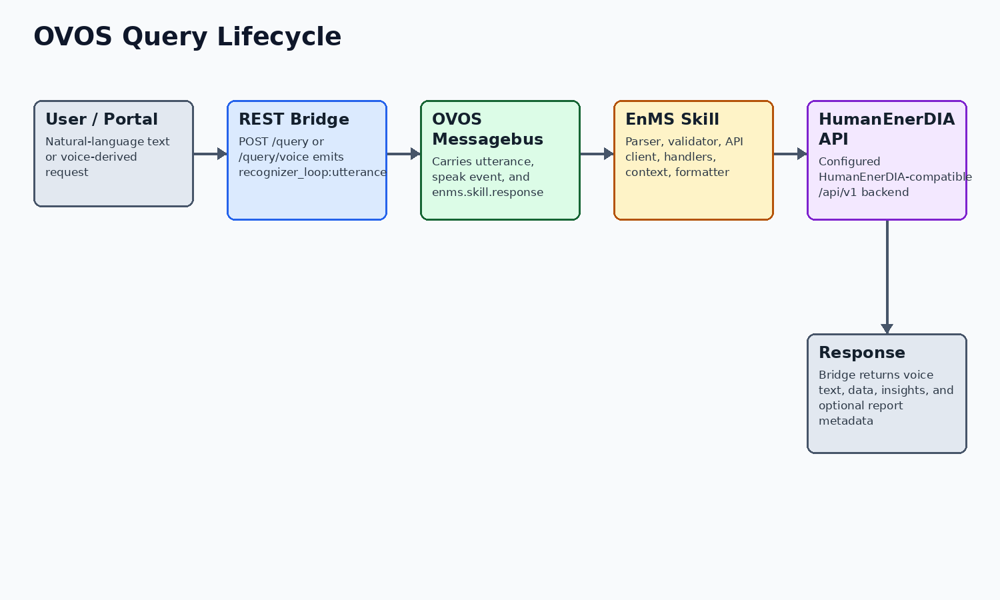

# Skill Documentation

Project: WASABI / HumanEnerDIA / OVOS-EnMS
Version: 1.1
Date: 2026-06-09
Status: Final stakeholder-ready documentation package

Purpose: Document the OVOS-EnMS skill, REST bridge, parser, validation, API client, and response behavior.
Audience: OVOS integrators, WASABI technical reviewers, backend maintainers, and external partners.

Source basis: OVOS-EnMS evidence comes from the separate OVOS-EnMS source repository, with HumanEnerDIA API integration evidence from the HumanEnerDIA production tree.

## Purpose And Boundaries

The HumanEnerDIA OVOS skill is the natural-language assistant layer for industrial energy-management questions. It is not the HumanEnerDIA backend and does not own telemetry storage or KPI calculation. It connects to a reachable HumanEnerDIA-compatible analytics API.

The production integration boundary is the HumanEnerDIA-compatible REST API. The repository includes adapter abstractions, but v1.0.0 documentation states that arbitrary third-party EnMS APIs require an adapter or proxy that exposes the expected API contract.

## Deployment And Configuration

The separate OVOS-EnMS repository provides a Docker Compose service that exposes the REST bridge on port 5000 and the OVOS messagebus on port 8181. The HumanEnerDIA production base docker-compose.yml does not define an OVOS service, so production documentation must treat OVOS-EnMS as a companion repository/runtime unless a production overlay is explicitly added and tracked.

Key configuration includes ENMS_API_URL, OVOS_BRIDGE_PORT, STRUCTURED_RESPONSE_GRACE_SECONDS, OVOS_TTS_ENABLED, LOG_LEVEL, OVOS_CONFIG_PATH, and XDG_CONFIG_HOME. Skill-level settings include enms_api_base_url, llm_model_path, confidence_threshold, and progress feedback options.

The table below summarizes the runtime configuration points that determine how OVOS connects to the EnMS backend.

| Configuration item | Observed default or behavior | Evidence |
| --- | --- | --- |
| ENMS_API_URL | Docker default points at a HumanEnerDIA-compatible /api/v1 backend | OVOS-EnMS repository: docker-compose.yml |
| enms_api_base_url | Skill setting for backend API URL | settings.docker.json; settingsmeta.yaml |
| confidence_threshold | Default 0.85 in settings and validator configuration | settings.docker.json; lib/validator.py |
| INSTALL_LLM_FALLBACK | Build argument for installing optional LLM dependencies in the Dockerfile | OVOS-EnMS repository: Dockerfile |

Correct backend URL configuration is central to OVOS readiness: the assistant can answer operational questions only when it can reach the EnMS-compatible API.

## Configuration Reference

The configuration items below are taken from the OVOS-EnMS Dockerfile, Compose file, settings files, bridge, and validator. They are operational settings, not secrets; actual runtime values should still be reviewed in the deployed environment.

The configuration table groups environment-driven settings without exposing private runtime values.

| Setting | Location | Purpose |
| --- | --- | --- |
| ENMS_API_URL | Container environment variable | Backend API base URL for the OVOS runtime/bridge environment. |
| OVOS_BRIDGE_PORT | Container environment variable | REST bridge listen port; default 5000. |
| OVOS_MESSAGEBUS_PORT | Compose port | Messagebus port exposed by OVOS-EnMS Compose; default 8181. |
| STRUCTURED_RESPONSE_GRACE_SECONDS | Bridge environment variable | Additional wait for structured enms.skill.response payload after speech event. |
| OVOS_TTS_ENABLED | Bridge/runtime environment variable | Controls TTS behavior in the OVOS runtime. |
| llm_model_path | Skill setting | Configured GGUF path for optional LLM parser fallback. |
| confidence_threshold | Skill/validator setting | Minimum confidence for accepted parsed intents; default observed value is 0.85. |
| enable_fuzzy_matching | Skill/validator setting | Allows fuzzy machine-name matching and suggestions. |
| api_timeout_seconds / api_max_retries | Skill settings | Backend request timeout and retry behavior. |

Together, these settings define how the assistant connects, listens, validates, and optionally uses fallback parsing. Runtime values should be controlled by the deployment owner.

## Query Lifecycle

The REST bridge exposes GET /health and POST /query. POST /query/voice is an alias used by the analytics proxy when audio-capable flows request the same bridge behavior.

For each query, the bridge creates or uses a session id, emits recognizer_loop:utterance to the OVOS messagebus, and waits for a speak message plus, when available, an enms.skill.response structured payload. The response returns success status, spoken response text, intent, confidence, data, insights, timestamp, and session id.

The EnMS skill receives the utterance through OVOS intent handlers or fallback handling. It parses the utterance, validates intent/entity output, calls the configured backend API, formats a deterministic response, speaks it, and emits structured response data for the bridge or portal widget.

## Supported Intent And Query Families

The active IntentType enum and skill handlers show the supported query families below. This table is not a guarantee that every phrasing is understood; it identifies implemented categories in the skill code.

The intent family table explains the categories of operational questions represented in the skill code.

| Intent family | Purpose |
| --- | --- |
| energy_query | Energy use questions by machine or factory scope |
| power_query | Current or historical power demand questions |
| machine_status | Machine running/offline/status checks |
| factory_overview | Factory/facility summaries, machine lists, aggregate status |
| comparison | Machine-to-machine comparisons |
| ranking | Top or lowest machines by energy, power, cost, efficiency, or alerts |
| anomaly_detection | Active/recent anomaly and alert queries |
| cost_analysis | Cost and spending questions |
| forecast | Forecasted demand and future energy usage |
| baseline, baseline_models, baseline_explanation | Baseline prediction, model inventory, and driver explanation |
| driver_analysis | Energy driver analysis for factory or SEU/machine context |
| seus | Significant Energy Use listing and context |
| kpi, performance, production | KPIs, performance analysis, production/OEE-related queries |
| report | Report type, preview, and generation workflows |
| help, health | Capability help and system health checks |

The intent families show broad operational coverage while still depending on parser confidence, backend data, and machine names present in the target system.

## Intent Parsing And Routing

The parser is hybrid. Tier 1 is regex-based heuristic routing for common operational queries. Tier 2 uses Adapt pattern matching and registered vocabulary. Tier 3 is an optional local Qwen GGUF LLM parser used as fallback when dependencies and model files are available.

The active parser code includes patterns for production, anomaly detection, forecasts, KPIs, performance, baselines, driver analysis, SEUs, rankings, factory overview, status, power, and related query types. Adapt vocabulary registers machine names, spoken number variants, energy/power/status/cost/KPI/factory/comparison/time/forecast/anomaly/help terms and more.

The parser table shows the ordered routing strategy from fast deterministic handling to optional fallback parsing.

| Tier | Implementation | Important note |
| --- | --- | --- |
| Heuristic | Regex patterns in lib/intent_parser.py | Fast path for common operational wording. |
| Adapt | IntentDeterminationEngine in lib/adapt_parser.py | Pattern/vocabulary matching with registered machine and domain terms. |
| LLM | Qwen3Parser in lib/llm_parser.py | Optional fallback requiring llama-cpp-python and a GGUF model file. |

This layered routing model keeps common questions fast and deterministic, while optional fallback parsing expands coverage when properly configured.

## Validation And Fuzzy Matching

Validation is deliberately conservative. The validator builds a Pydantic Intent model, checks confidence, rejects unknown intent types, validates machine names against a whitelist, supports fuzzy matching and number-word normalization, detects ambiguity, validates multi-machine comparisons, and performs soft metric validation.

Machine discovery can refresh the whitelist from the backend API during runtime; fallback machine names are configured for cases where API discovery fails. This helps prevent hallucinated machine names from becoming backend calls.

## Backend API Client And Adapter Behavior

The ENMSClient wraps async HTTP calls to the configured backend. It uses connection pooling, request timeout management, and tenacity retry behavior that retries connection/timeouts and server-side 5xx responses while avoiding retries on ordinary 4xx client errors.

Client methods cover health, stats, machines, time series, top consumers, anomalies, KPIs, performance opportunities, action plans, forecasts, baseline models/explanations, SEU/energy-source data, reports, and ISO 50001 EnPI/action-plan endpoints. The production path remains HumanEnerDIA-compatible API usage.

The backend-client table shows the EnMS API areas the skill can call after parsing and validation.

| Client area | Representative methods | Evidence |
| --- | --- | --- |
| System and machines | health_check, system_stats, factory_summary, list_machines, get_machine_status | OVOS-EnMS repository: enms-ovos-skill/enms_ovos_skill/lib/api_client.py |
| Telemetry | get_energy_timeseries, get_power_timeseries, get_latest_reading, get_multi_machine_energy | OVOS-EnMS repository: enms-ovos-skill/enms_ovos_skill/lib/api_client.py |
| Analytics | detect_anomalies, get_all_kpis, analyze_performance, forecast_demand, predict_baseline | OVOS-EnMS repository: enms-ovos-skill/enms_ovos_skill/lib/api_client.py |
| Reports and ISO | get_enpi_report, list_action_plans, get_report_types, preview_report, generate_report | OVOS-EnMS repository: enms-ovos-skill/enms_ovos_skill/lib/api_client.py |

The client layer is the bridge between language understanding and EnMS data. Its retry behavior helps with transient backend issues without hiding persistent configuration errors.

## Backend Method Mapping

This mapping connects natural-language intent families to backend client methods and the HumanEnerDIA-compatible API areas they use. It defines implementation traceability; accepted phrasing still depends on parser coverage, validation, backend data, and deployment health.

This mapping connects natural-language categories to backend methods and API areas for implementation traceability.

| Intent family | Primary backend method(s) | API area | Returned information |
| --- | --- | --- | --- |
| Factory overview | factory_summary | /factory/summary | Factory-wide status, energy, cost, machine, and anomaly summary. |
| Machine status | get_machine_status | /machines/status/{machine_name} | Current machine state and related statistics. |
| Machine list | list_machines | /machines | Available/active machine inventory and machine-name discovery. |
| Energy query | get_energy_timeseries, get_latest_reading | /timeseries/energy, /timeseries/latest/{machine_id} | Historical or latest energy data after machine lookup. |
| Power query | get_power_timeseries, get_machine_status | /timeseries/power, /machines/status/{machine_name} | Current or historical power answer. |
| Ranking/top consumers | get_top_consumers | /analytics/top-consumers or /ovos/top-consumers | Top/bottom consumers by supported metric. |
| Anomalies | get_recent_anomalies, detect_anomalies | /anomaly/recent, /anomaly/detect | Recent or active anomaly information. |
| KPIs | get_all_kpis and KPI-specific methods | /kpi/all and KPI routes | SEC, peak demand, load factor, cost, carbon and related rollups. |
| Baselines/drivers | predict_baseline, list_baseline_models, get_baseline_drivers | /baseline/* | Baseline prediction, models, and energy-driver explanations. |
| Reports | get_report_types, preview_report, generate_report | /reports/types, /reports/preview, /reports/generate | Report discovery, preview, and generation. |

The mapping gives integrators a practical checklist for adapter compatibility when connecting OVOS to another EnMS backend.

## Response Formatting

The response formatter uses Jinja2 templates and custom number/unit/time filters. The formatter documentation and code explicitly state that final responses should come from API data and templates rather than free-form LLM generation.

Additional enrichment exists for anomaly responses, including severity grouping, resolved/unresolved counts, metric/anomaly label humanization, and concise spoken examples.

## Example Supported Queries

The examples below are representative of implemented intent categories and handler/parser coverage. Exact results depend on available machines, backend data, current telemetry, and deployment health.

The example table provides representative phrases that illustrate supported query families and expected usage patterns.

| Category | Example query |
| --- | --- |
| Energy | How much energy did Compressor-1 use yesterday? |
| Power | What is the current power of Boiler-1? |
| Status | Is HVAC-Main running? |
| Overview | Give me a factory overview. |
| Ranking | Show the top three energy consumers today. |
| Comparison | Compare Compressor-1 and Compressor-EU-1. |
| Anomalies | Any active anomalies today? |
| Forecast | What is tomorrow's demand forecast? |
| Baseline | What is the baseline for Injection-Molding-1? |
| Drivers | Explain the energy drivers for Compressor-1. |
| SEUs | List significant energy uses. |
| Reports | Generate a monthly energy report. |
| Health/help | What can you do? Is the system healthy? |

The examples should be used as smoke-test and training phrases, with expected answers determined by the data currently available in the EnMS backend.

## Optional LLM Fallback

Fast heuristic and Adapt routing are the normal path. The OVOS-EnMS Dockerfile installs LLM fallback dependencies only when INSTALL_LLM_FALLBACK=true, and the skill settings point to a configurable GGUF model path. Model-file availability must be verified in the OVOS-EnMS runtime; the HumanEnerDIA production Compose file does not bundle or start OVOS.

The LLM parser uses llama-cpp-python when installed, loads a configured GGUF model, performs deterministic JSON intent classification, and returns None on missing dependencies, missing model, parse failures, or timeout. It should be documented as optional fallback, not as required normal operation.

## Failure Behavior

The assistant layer should be represented as conservative. Parser/validator failures, missing machines, backend errors, and missing optional LLM dependencies should result in clarification or failure responses rather than fabricated energy data.

The failure table explains how the assistant should behave when parsing, validation, backend connectivity, or optional components are unavailable.

| Failure case | Observed behavior |
| --- | --- |
| Messagebus unavailable | REST bridge health reports disconnected state; query handling cannot complete normal OVOS event round trip. |
| Backend API unavailable | ENMSClient logs request/connect errors; skill should return failure/clarification rather than fabricated KPI values. |
| Low confidence parse | Validator rejects output below threshold and suggests rephrasing. |
| Unknown machine | Validator rejects invalid names and can suggest fuzzy matches. |
| Ambiguous comparison | Validator expands groups when possible or asks for clarification when insufficient machines match. |
| Template failure | Skill has fallback response generation for several intent/data shapes. |
| LLM dependencies/model missing | Hybrid parser continues with heuristic/Adapt tiers and clarification fallback; LLM fallback is optional. |

The failure behavior supports trustworthy operation: unclear or unsupported inputs should lead to clarification or explicit failure rather than fabricated operational values.

## Limitations And Assumptions

This section summarizes the current validation status, scope boundaries, and operational considerations for the delivered system.

The limitations table defines scope boundaries that affect validation, audit use, optional assistant behavior, and production readiness.

| Item | Status |
| --- | --- |
| Runtime verification | Compose validation is confirmed where stated. Live health checks are deployment-specific and require a running target environment. |
| OVOS deployment boundary | The GitHub production base docker-compose.yml does not define an OVOS service. OVOS-EnMS is documented as a separate source repository and companion assistant runtime. |
| OVOS optional LLM fallback | The OVOS-EnMS Dockerfile installs LLM fallback dependencies only when INSTALL_LLM_FALLBACK=true. Model availability must be verified in the OVOS-EnMS repository/runtime. |
| Third-party EnMS support | OVOS portability is through a HumanEnerDIA-compatible API or adapter/proxy, not zero-code support for arbitrary vendor APIs. |
| Reports V2 | V2 report code is implemented, but some service calculations use derived, proportional, or placeholder values. Formal audit use requires independent validation of formulas, source data, tariff factors, carbon factors, and generated report semantics. |
| Simulator inventory | The simulator code supports boiler in addition to compressor, HVAC, motor, pump, and injection molding. One simulator info response still lists five machine types. |
| Security posture | The codebase provides secret placeholders, generated first-run credentials, JWT/bcrypt auth, health checks, and hardening guidance. Public production exposure still requires operator DNS/TLS/firewall/credential work. |

Together, these points define the verified scope of the current delivery and the operational responsibilities required before production use. They preserve a clear distinction between implemented capability, deployment configuration, and assurance activities that belong to the target operating environment.

## Source References

The table below lists the main source material used for this document. It is not a full file inventory; it identifies the sources behind the material claims.

The source reference table links the document's major claims to the tracked files or validation evidence used to support them.

| Topic | Source material |
| --- | --- |
| REST bridge | OVOS-EnMS repository: enms-ovos-skill/bridge/ovos_rest_bridge.py |
| Skill lifecycle and handlers | OVOS-EnMS repository: enms-ovos-skill/enms_ovos_skill/__init__.py |
| Intent parser tiers | OVOS-EnMS repository: enms-ovos-skill/enms_ovos_skill/lib/intent_parser.py; lib/adapt_parser.py; lib/llm_parser.py |
| Validation | OVOS-EnMS repository: enms-ovos-skill/enms_ovos_skill/lib/validator.py |
| API client | OVOS-EnMS repository: enms-ovos-skill/enms_ovos_skill/lib/api_client.py |
| Response formatter | OVOS-EnMS repository: enms-ovos-skill/enms_ovos_skill/lib/response_formatter.py |
| Configuration and deployment | OVOS-EnMS repository: docker-compose.yml; Dockerfile; enms-ovos-skill/config.yaml.template; enms-ovos-skill/settings.docker.json; enms-ovos-skill/settingsmeta.yaml |

These references provide traceability for technical claims. They are intended to support maintenance and verification without exposing secrets or local runtime state.
