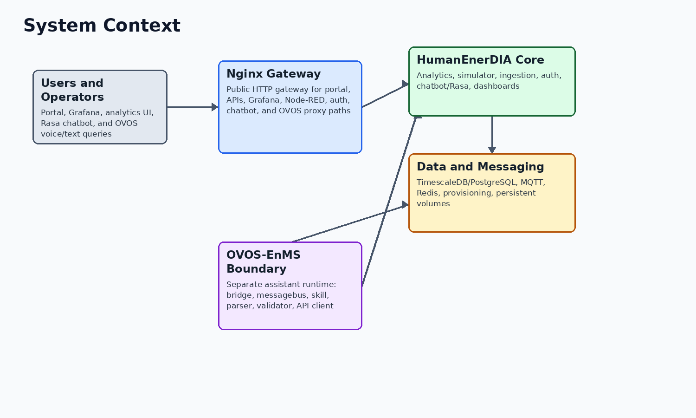

# System Architecture Report

Project: WASABI / HumanEnerDIA / OVOS-EnMS
Version: 1.1
Date: 2026-06-09
Status: Final stakeholder-ready documentation package

Purpose: Describe the implemented HumanEnerDIA / EnMS architecture and the OVOS-EnMS integration boundary.
Audience: Project managers, technical reviewers, deployment stakeholders, and external partners.

Source basis: Claims are tied to local source code, Docker configuration, SQL initialization files, and verified compose validation.

## Executive Summary

HumanEnerDIA is implemented as a Docker Compose based industrial energy management stack. It combines an Nginx gateway, a static portal, FastAPI analytics APIs, PostgreSQL/TimescaleDB storage, MQTT telemetry, Node-RED ingestion, Grafana dashboards, a simulator, authentication services, a Rasa text chatbot path, and an optional OVOS-EnMS voice/natural-language assistant layer.

The OVOS-EnMS component is a separate assistant runtime that connects to the HumanEnerDIA-compatible analytics API. Its REST bridge does not calculate energy answers by itself; it forwards user queries to the OVOS messagebus, where the EnMS skill parses, validates, executes API calls, and formats responses.

**Observed in code/config:** The GitHub production base stack is defined in docker-compose.yml and does not include an OVOS service. The separate OVOS-EnMS repository provides the OVOS Compose file, bridge, skill, parser, validator, API client, and response formatting source.

## System Context

The system has three boundaries that must remain distinct in delivery documentation. HumanEnerDIA / EnMS is the energy management backend and visualization stack. OVOS-EnMS is the voice/natural-language assistant layer that integrates with the analytics API. The Rasa chatbot is a text-oriented help and knowledge path, not the same runtime as the OVOS skill.

| Boundary | Included components | Evidence |
| --- | --- | --- |
| HumanEnerDIA / EnMS | Nginx, portal, analytics, PostgreSQL/TimescaleDB, MQTT, Node-RED, Grafana, simulator, auth-service, Rasa/chatbot services | docker-compose.yml |
| OVOS-EnMS | OVOS runtime, REST bridge, messagebus, EnMS skill, parser, validator, API client, response formatter | OVOS-EnMS repository: enms-ovos-skill/enms_ovos_skill/__init__.py |
| External users/integrators | Browser users, API clients, OVOS clients, operators, WASABI reviewers | README.md; verify.sh; docs/final-delivery/ |

## Component Responsibilities

The architecture separates gateway, domain API, storage, ingestion, visualization, simulation, authentication, text-help chatbot, and voice/natural-language assistant concerns. This separation is visible in the Compose service list and in the route/service/module layout.

| Component | Responsibility | Source basis |
| --- | --- | --- |
| Nginx | Public HTTP gateway, static portal host, reverse proxy, and health endpoint. | Configured service and routing rules in docker-compose.yml and nginx/conf.d/default.conf. |
| Analytics | Primary EnMS domain API: KPIs, baselines, forecasts, anomalies, reports, ISO 50001, machine/time-series data, OVOS proxy paths. | FastAPI application and router registrations in analytics/main.py. |
| PostgreSQL/TimescaleDB | Persistent relational and time-series storage, hypertables, continuous aggregates, SQL KPI functions, seed data. | database/init/*.sql. |
| MQTT | Telemetry broker for simulator/device payloads and Node-RED ingestion. | mqtt service in docker-compose.yml and simulator MQTT publisher. |
| Node-RED | MQTT topic parsing, payload validation, routing by data type, PostgreSQL writes, and simple ingestion monitoring. | nodered/data/flows.json. |
| Grafana | Provisioned dashboard runtime for operational, cost, carbon, EnPI, anomaly, forecast, model, and executive views. | grafana/provisioning and grafana/dashboards JSON. |
| Simulator | Synthetic factory telemetry service with configurable machine simulators and anomaly injection. | simulator/main.py; simulator/simulator_manager.py; simulator/api/routes.py. |
| auth-service | Registration, login, JWT verification, email verification/reset, admin APIs, contact and pilot factory forms. | auth-service/app.py; auth-service/auth_service.py. |
| chatbot/Rasa | Text help chatbot and custom Rasa action backed by qa_data.json. | chatbot/server/index.js; chatbot/rasa/actions/actions.py. |
| OVOS-EnMS | Separate natural-language/voice assistant runtime that calls a HumanEnerDIA-compatible API. | OVOS-EnMS repository: bridge, skill, parser, validator, API client, formatter. |

## Runtime Services

The base runtime service inventory below is taken from docker-compose.yml and verified by docker compose config --quiet during this documentation pass.

| Service | Image or build context | External port/path | Responsibility | Healthcheck |
| --- | --- | --- | --- | --- |
| nginx | nginx:1.25-alpine | 8080; 8443 mapped but HTTPS server block is optional/commented until certificates are configured | Public gateway, portal/static hosting, reverse proxy | Yes |
| postgres | timescale/timescaledb:latest-pg16 | 5433 | PostgreSQL with TimescaleDB extension and persistent data volume | Yes |
| mqtt | build ./mqtt | 1883, 9001 | Mosquitto telemetry broker with configured credentials | Yes |
| redis | redis:7-alpine | 6380 | Redis cache and Pub/Sub support for analytics event paths | Yes |
| simulator | build ./simulator | internal 8003 | FastAPI synthetic telemetry generator loaded from database machines | Yes |
| nodered | build ./nodered | 1881 | MQTT-to-database ingestion and automation flow runtime | Yes |
| grafana | grafana/grafana:10.2.0 | 3001, /grafana | Provisioned dashboards backed by PostgreSQL/TimescaleDB | Yes |
| analytics | build ./analytics | 8001, /api/analytics | FastAPI analytics, KPI, reports, ISO 50001, and OVOS proxy APIs | Yes |
| auth-service | build ./auth-service | 5500 | Flask auth, admin, contact, pilot/application APIs | Yes |
| rasa-actions | build ./chatbot/rasa | 5055 | Rasa custom action server | Yes |
| rasa | build ./chatbot/rasa | 5005 | Rasa NLU text chatbot server | Yes |
| chatbot | build ./chatbot | 5006 | Express backend and built chatbot frontend proxying to Rasa and OVOS | Yes |

## Dependency And Request Flow

The main runtime dependencies are directional: clients enter through gateway or assistant bridge paths, domain services call databases and supporting middleware, and telemetry flows from producers into storage before it is consumed by dashboards, APIs, reports, and assistants.

| Flow | Dependency chain |
| --- | --- |
| Telemetry path | simulator or external devices -> MQTT -> Node-RED -> PostgreSQL/TimescaleDB -> analytics/Grafana/reports/assistants |
| Dashboard path | browser -> Nginx -> Grafana -> PostgreSQL/TimescaleDB datasource |
| Analytics path | browser/API client -> Nginx -> analytics -> PostgreSQL/TimescaleDB and optional Redis |
| Authentication path | portal/auth pages -> Nginx -> auth-service -> PostgreSQL auth tables; SMTP is optional/configured through environment |
| Rasa help path | portal chatbot -> chatbot Express backend -> Rasa server -> Rasa action server -> qa_data.json |
| OVOS operational path | REST bridge or portal proxy -> OVOS messagebus -> EnMS skill -> HumanEnerDIA-compatible analytics API -> structured response |

## Data And Message Flow

Synthetic factory data or external device data enters through MQTT. Node-RED subscribes to factory/#, parses the topic structure, routes by payload type, validates required fields, and writes energy, production, environmental, and status data into PostgreSQL.

TimescaleDB hypertables and continuous aggregates provide raw and aggregated time-series views. The analytics service reads from those tables and aggregate views to support KPIs, baselines, forecasts, anomalies, reports, Grafana dashboards, and OVOS-facing responses.

| Stage | Observed implementation | Evidence |
| --- | --- | --- |
| Telemetry source | simulator loads active machines from PostgreSQL and publishes MQTT messages for energy, production, environmental, status, and multi-energy boiler topics | simulator/main.py; simulator/api/routes.py; simulator/simulator_manager.py; simulator/mqtt_publisher.py |
| Broker | mqtt service exposes 1883 and websocket 9001 with credentials supplied through environment variables | docker-compose.yml |
| Ingestion | Node-RED flow includes Subscribe: factory/#, Parse Topic, Route by Type, Process Energy/Production/Environmental/Status, and PostgreSQL output nodes | nodered/data/flows.json; nodered/settings.js; nodered/package.json |
| Storage | energy_readings, production_data, and environmental_data are converted to TimescaleDB hypertables with continuous aggregates | database/init/02-schema.sql; database/init/03-timescaledb-setup.sql; database/init/04-functions.sql |
| Consumption | Analytics API, Grafana dashboards, portal, chatbot, and OVOS integration consume database-backed data | analytics/main.py |

## External And Internal Interfaces

External browser access normally enters through Nginx. Direct service ports are exposed for operations and development; production exposure should be restricted by firewall or reverse proxy policy.

| Interface | Route or endpoint | Evidence/notes |
| --- | --- | --- |
| Unified portal | http://<host>:8080 | Served by Nginx from portal/public |
| Grafana | http://<host>:8080/grafana | Sub-path proxy to Grafana with provisioned dashboards |
| Analytics UI | http://<host>:8080/analytics/ui/ | FastAPI-rendered analytics templates |
| Analytics API docs | http://<host>:8080/api/analytics/docs | Nginx proxy to analytics OpenAPI docs |
| Simulator docs | http://<host>:8080/api/simulator/docs | Nginx proxy to simulator OpenAPI docs |
| Node-RED | http://<host>:1881 or http://<host>:8080/nodered/ | Admin UI protected by Node-RED credentials |
| OVOS bridge | http://<host>:5000/health | Available when the separate OVOS-EnMS runtime is deployed |
| Analytics health | Direct service path /api/v1/health; through Nginx analytics proxy /api/analytics/api/v1/health | analytics/main.py; nginx/conf.d/default.conf |
| OVOS proxy via EnMS | /api/ovos/* -> /api/v1/ovos/* | nginx/conf.d/default.conf; analytics/api/routes/ovos_voice.py |
| OVOS direct bridge | POST /query, POST /query/voice, GET /health | OVOS-EnMS repository: enms-ovos-skill/bridge/ovos_rest_bridge.py |

## OVOS-EnMS Integration

The OVOS bridge receives text queries through /query or /query/voice. It emits recognizer_loop:utterance to the OVOS messagebus and listens for speak and enms.skill.response events. The skill handles intent routing, context, validation, backend API calls, and deterministic response formatting.

HumanEnerDIA also exposes /api/v1/ovos/voice/query and /api/v1/ovos/voice/health as a proxy route from the analytics service to the OVOS bridge. This supports portal-side integration without making the portal responsible for OVOS messagebus details.

## Deployment Variants And Boundaries

The GitHub production tree supports a HumanEnerDIA base deployment. OVOS-EnMS should be described as a companion runtime sourced from its own repository unless and until a production Compose overlay is tracked in the HumanEnerDIA production repository.

| Variant | Source | Boundary statement |
| --- | --- | --- |
| Base production Compose | docker-compose.yml in GitHub production | HumanEnerDIA services only. No OVOS service appears in the current production service list. |
| Separate OVOS-EnMS runtime | OVOS-EnMS repository docker-compose.yml | Companion assistant runtime exposing bridge/messagebus ports and connecting to a HumanEnerDIA-compatible API. |
| Evaluation/demo deployment | setup.sh with generated first-run secrets and simulator auto-start | Suitable for review and demonstration after health checks pass; not a substitute for production hardening. |
| Production-hardened deployment | Operator-controlled DNS/TLS/firewall/backups/monitoring | Supported by configuration hooks but not automatically completed by the repository. |

## Security And Network Boundaries

The repository supports several operational controls, but public production hardening remains an operator responsibility. The setup helper creates .env from .env.example when needed and generates first-run secrets for database, Grafana, Node-RED, Redis, MQTT, JWT, and API key values.

Authentication is implemented by auth-service using bcrypt password hashing, JWT sessions, email verification and password reset flows, admin allow-listing from environment variables, session tracking, and audit tables. Node-RED has admin authentication configured through environment-provided credentials.

- Do not commit .env, generated secrets, runtime logs, database dumps, model caches, or Docker volumes.
- Restrict direct exposure of PostgreSQL, Redis, MQTT, Grafana, Node-RED, and service debug ports in production.
- Terminate TLS at Nginx or an upstream reverse proxy before internet-facing deployment.
- Rotate credentials before public use, especially any generated first-run secrets.

## Operational Risks

The following risks are not defects in the documentation package; they are deployment and governance points that should remain visible in stakeholder handover material.

| Risk area | Observed source basis | Operational action |
| --- | --- | --- |
| Directly mapped internal ports | PostgreSQL, MQTT, Redis, Grafana, Node-RED, analytics, auth, Rasa, chatbot, simulator ports are mapped for access/operations. | Restrict with firewall or upstream network policy before public exposure. |
| Runtime data persistence | Named Docker volumes retain database, Grafana, MQTT, Redis, and Node-RED data. | Back up before destructive redeployments or volume removal. |
| Credentials | .env is generated locally and ignored; .env.example contains placeholders. | Rotate generated credentials and never disclose .env values. |
| Report semantics | Some V2 report calculations use estimates/placeholders. | Label audit-grade use as requiring review and validation. |
| OVOS availability | Production base Compose does not start OVOS. | Deploy and verify OVOS-EnMS separately when assistant access is in scope. |

## Limitations And Assumptions

The following items should be reviewed before stakeholder distribution. They are documented to avoid overstating the current implementation.

| Item | Status |
| --- | --- |
| Runtime verification | This documentation package records compose validation. Live health checks require a running deployment and are not implied unless run separately. |
| OVOS deployment boundary | The GitHub production base docker-compose.yml does not define an OVOS service. OVOS-EnMS is documented as a separate source repository and companion assistant runtime. |
| OVOS optional LLM fallback | The OVOS-EnMS Dockerfile installs LLM fallback dependencies only when INSTALL_LLM_FALLBACK=true. Model availability must be verified in the OVOS-EnMS repository/runtime. |
| Third-party EnMS support | OVOS portability is through a HumanEnerDIA-compatible API or adapter/proxy, not zero-code support for arbitrary vendor APIs. |
| Reports V2 | V2 report code is implemented, but some service calculations use derived/proportional or placeholder values; final stakeholders should review report semantics before audit use. |
| Simulator inventory | The simulator code supports boiler in addition to compressor, HVAC, motor, pump, and injection molding. One simulator info response still lists five machine types. |
| Security posture | The codebase provides secret placeholders, generated first-run credentials, JWT/bcrypt auth, health checks, and hardening guidance. Public production exposure still requires operator DNS/TLS/firewall/credential work. |

## Source References

The table below lists the main source material used for this document. It is not a full file inventory; it identifies the sources behind the material claims.

| Topic | Source material |
| --- | --- |
| Runtime topology | docker-compose.yml |
| OVOS deployment boundary | OVOS-EnMS repository: docker-compose.yml; Dockerfile; enms-ovos-skill/config.yaml.template; enms-ovos-skill/settings.docker.json; enms-ovos-skill/settingsmeta.yaml |
| Routing | nginx/nginx.conf; nginx/conf.d/default.conf |
| Database and KPIs | database/init/02-schema.sql; database/init/03-timescaledb-setup.sql; database/init/04-functions.sql |
| Analytics API | analytics/main.py |
| OVOS bridge and skill | OVOS-EnMS repository: enms-ovos-skill/bridge/ovos_rest_bridge.py; OVOS-EnMS repository: enms-ovos-skill/enms_ovos_skill/__init__.py |
| Compose validation | docker compose config --quiet returned success for the HumanEnerDIA production tree and the OVOS-EnMS repository compose file |
